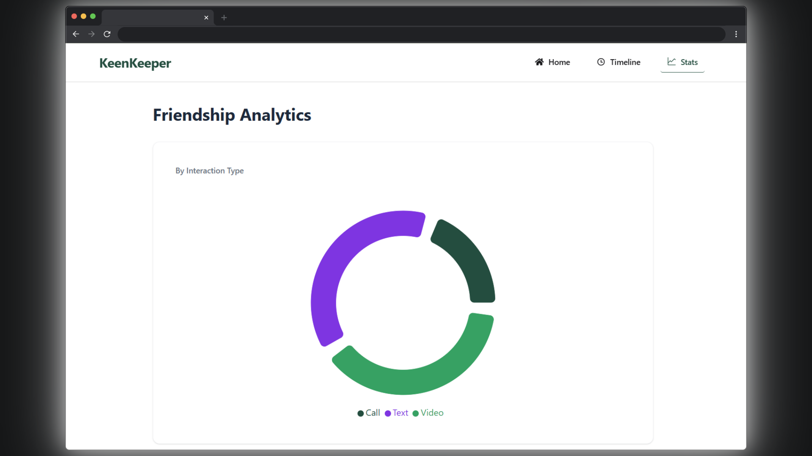

# Keen Keeper - Relationship Manager App

Keen Keeper is a relationship management app that helps users stay consistently
connected with the people who matter most, turning communication habits into
measurable, visual insights.

## ✨ Key Features

- **Interaction Logging** - Every call, text, and video interaction is logged
  with the contact's name in a visual timeline, giving users a clear picture of
  who they have been in touch with and when.
- **Interaction Filter** - Users can filter their timeline by interaction type -
  audio call, video call, or text — to instantly see their communication history
  with each person.
- **Smart Reminders** - Users can set reminders to reach out before important
  moments, ensuring meaningful relationships are nurtured before it is too late.
- **Stats Dashboard** - A dedicated stats page displays interaction patterns
  through charts, showing how much attention has been given to each
  relationship.

## 👥 Who Is It For?

Keen Keeper is built for **remote workers** who struggle to stay connected
across time zones, **socially conscious individuals** who want to be intentional
about their relationships, and anyone who has ever realized too late that they
have drifted from someone they care about.

## 🛠️ Tech Stack

## 🔗 Links

